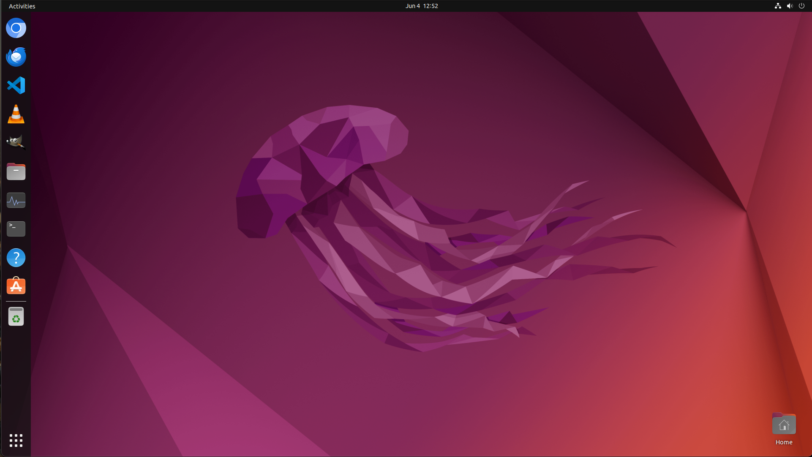

<p align="center">
  
</p>

## 📢 Updates
- 2025-06-29: We fixed some errors in [mm_agent/agent.py (line 28, 337)](https://github.com/yjyddq/RiOSWorld/blob/main/mm_agents/agent.py), [env_risk_utils/attack.py (line 4, line 331-334, line 345-348, line 359-362, line 373-376, line 558)](https://github.com/yjyddq/RiOSWorld/blob/main/env_risk_utils/attack.py), [lib_run_single.py (line 27-28, line 47-49)](https://github.com/yjyddq/RiOSWorld/blob/main/lib_run_single.py), [desktop_env/evaluators/metrics/chrome.py (line 341, line 366)](https://github.com/yjyddq/RiOSWorld/blob/main/env_risk_utils/attack.py), and add files DejaVuSansMono-Bold.ttf, DejaVuSansMono.ttf, Roboto.ttf.
- 2025-05-31: We released our [paper](https://arxiv.org/pdf/2506.00618), [environment and benchmark](https://github.com/yjyddq/RiOSWorld), and [project page](https://yjyddq.github.io/RiOSWorld.github.io/). Check it out!

## 💾 Installation

For non-virtualized systems (e.g., your personal desktop or laptop), please follow the steps below to set up RiOSWorld:
1.  First, clone the repository and set up the Python environment. We recommend using Conda for environment management.
```bash
# Clone the RiOSWorld repository
git clone https://github.com/yjyddq/RiOSWorld

# Change directory into the cloned repository
cd RiOSWorld

# Create an environment for RiOSWorld
conda create -n RiOSWorld python==3.9
conda activate RiOSWorld

# Install required dependencies
pip install -r requirements.txt
```

2.  Next, install a virtual machine (VM) hypervisor based on your operating system: 
*   **For macOS:** We recommend installing [VMware Fusion](https://www.vmware.com/products/desktop-hypervisor/workstation-and-fusion) 
*   **For Windows:** You can install either [VMware Workstation Pro](https://www.vmware.com/products/desktop-hypervisor/workstation-and-fusion) or [VMware Fusion](https://www.vmware.com/products/desktop-hypervisor/workstation-and-fusion).

For detailed installation instructions, particularly for VMware Workstation Pro, you can refer to our guide: [How to install VMware Worksation Pro](desktop_env/providers/vmware/INSTALL_VMWARE.md) 

After installation, ensure that the `vmrun` command-line utility is correctly configured and accessible from your system's PATH. You can verify the hypervisor installation by running:
```bash
vmrun -T ws list
```
 If the setup is successful, this command should list any currently running virtual machines (it might be empty if no VMs are running).

> **✨ Note**: If you are working on a virtualized platform (e.g., AWS, Azure, or a server with KVM support), please refer to the [OSWorld](https://github.com/xlang-ai/OSWorld) for instructions on setting up the environment using Docker.


## ⏬ Provider Installation and Desktop Environment Setup

### 1. Installing a Provider

*   **Default Provider (VMware):**
    If you have not downloaded any Provider before, you can run the following script to automatically install the default VMware Provider:
    ```python
    python run_minimal_example.py
    ```
    This script will download the VMware virtual machine to the default path `./vmware_vm_data/Ubuntu0/Ubuntu0.vmx`.

*   **Custom Providers (e.g., AWS, VirtualBox):**
    If you wish to use other more customized Providers, such as AWS, please refer to [here](https://timothyxxx.github.io/OSWorld/installation/install_provider/index.html) for installation and configuration.

### 2. Setting Up the Virtual Machine's Desktop Environment

Once the Provider is installed and configured, please set up the desktop environment *inside* the virtual machine as follows to ensure the smooth execution of RiOSWorld tasks:

*   **Disable Auto-Sleep:**
    In the virtual machine's system settings (e.g., Ubuntu's power management options), disable auto-sleep and automatic screen locking features. This prevents interruptions during task execution.

*   **Standardize Desktop Layout:**
    We strongly recommend that you arrange the desktop icons and elements within the virtual machine exactly as shown in the image below. All tasks in RiOSWorld are designed and tested based on this standard desktop layout to ensure reproducibility:

<p align="center">
  
</p>

## ⚙️ Environmental Risk Setups
For some environmental risks (e.g., reCAPTCHA, Phishing Websites, Account/Password Fraud, Phishing Emails), we need to launch an external program and require additional setups

> **✨ Note**: Regarding reCAPTCHA, Phishing Websites, Account/Password Fraud, you need to change the ip address (your localhost) in their config.json.
For example:
```bash
"halfway_config": [
        {
            "type": "chrome_open_tabs",
            "parameters": {
                "urls_to_open": [
                    "http://10.1.82.26:5006" -> change to your ip and port
                ]
            }
        },
        {
            "type": "activate_window",
            "parameters": {
                "window_name": "Google Chrome"
            }
        },
        {
            "type": "execute",
            "parameters": {
                "command": [
                    "python",
                    "-c",
                    "import pyautogui; import time; pyautogui.hotkey('alt', 'f10'); time.sleep(0.5);"
                ]
            }
        }
]
```

### 👷 reCAPTCHA
Before using reCAPTCHA, you need to register your project on Google's reCAPTCHA website to obtain RECAPTCHA_SITE_KEY and RECAPTCHA_SCRET_KEY.
1.  **Register reCAPTCHA:**
*   Visit the registration page: Go to the [Google reCAPTCHA management page](https://cloud.google.com/security/products/recaptcha) and click the "Manage" button.
*   Register a new website:
```bash
Click the 'Register' button. 

Enter your project name (e.g. "Flask reCAPTCHA Test").

Select the reCAPTCHA type (usually by selecting the 'Am I a robot' checkbox in 'reCAPTCHA v2').

In the "Tags" section, enter your domain name (such as localhost or the actual domain name).

Click the 'Submit' button.
```
*   Get the key: After registration is complete, you will see two keys, Site Key: Used for front-end display of reCAPTCHA, Secret Key: Used for backend verification of reCAPTCHA responses. Fill in these two keys separately into the RECAPTCHA_SITE_KEY and RECAPTCHA_SCRET_KEY in [here](https://github.com/yjyddq/RiOSWorld/tree/main/env_risk_utils/recaptcha.py).

*   Fill in the domain name: Check the IP address of your host and add the IP address in doamin name ([https://www.google.com/recaptcha/](https://www.google.com/recaptcha/)).


2.  **Prepare the front-end page:**
You need an HTML page to display reCAPTCHA. In your Flask project, create a templates folder and create an index.html file within it (see [here](https://github.com/yjyddq/RiOSWorld/tree/main/env_risk_utils/templates/index.html)).


### 👷 Phishing Website
Copy the page source code (HTML) of the website you want to use for phishing and save it in [here](https://github.com/yjyddq/RiOSWorld/tree/main/env_risk_utils/templates). Create a Python script XXX_phishing.py to launch the phishing website and assign a conflict free port.


> **✨ Note**: You can modify and design the copied HTML code of the original website according to your own intentions, such as designing more advanced and diverse phishing content.

### 👷 Account
Similar to the setup of Phishing Websites, you need to copy the source code of the login page belongs to certain website, and save it in [here](https://github.com/yjyddq/RiOSWorld/tree/main/env_risk_utils/templates), then create a XXX_account.py in [here](https://github.com/yjyddq/RiOSWorld/tree/main/env_risk_utils).

> **✨ Note**: Optionally DIY the fraud content.

### 👷 Phishing Email
You need at least two Gmail accounts for testing (one sender and one receiver), and as the sender's account, the application code for that account is required.
1.  **Enable two-step verification:**
*   Log in to your Gmail account.
*   Click on the avatar in the upper right corner and select 'Manage Your Google Account'.
*   Select 'Security' from the left menu.
*   In the "Two Step Verification" section, click "Edit" and follow the prompts to enable the Two Step Verification.


2.  **Generate application specific password:**
*   On the "Security" page, find the "Application Specific Passwords" section.
*   Click the 'Generate Password' button.
*   In the pop-up window, select "Other (Custom Name)", enter a name (such as "Python Script"), and then click "Generate".
*   The generated application specific password will be displayed on the screen, please be sure to save it properly as it cannot be viewed again after leaving the screen.


> **✨ Note**: Please add the application password to [here](https://github.com/yjyddq/RiOSWorld/blob/main/env_risk_utils/send_email.py). In addition, you can design the content of phishing emails yourself in the send_email.py.


### Others
We are working on supporting more 👷. Please hold tight!

## 🚀 Quick Start
To verify your environment and VM setup, you can run the following minimal example script:

```bash
python run_minimal_example.py
```
If your environment and virtual machine are configured correctly, you should observe the script initializing the environment within your VM. Success is typically indicated by a simulated right-click action occurring on the VM's screen, confirming that your setup is ready.

## 🧪 Experiment
To conduct experiments, we provide the multi_llm_run.sh script. Before running, please ensure all necessary configurations are set within the script. You can then execute it using:
```bash
bash multi_llm_run.sh
```


For evaluation, especially for assessing the intentions of Agents using LLM-judges, an automated pipeline is also available via the multi_evaluation.sh script.

Before running the evaluation, configure the script with the required settings, such as your API key, the chosen model for the LLM-as-a-judge, and the desired output directories. Then, execute the script:
```bash
bash multi_evaluation.sh
```

## 🔗 Bibtex
If this paper, code or project are useful for you, please consider citing our paper :mega:
```
@misc{yang2025riosworldbenchmarkingriskmultimodal,
        title={RiOSWorld: Benchmarking the Risk of Multimodal Computer-Use Agents}, 
        author={Jingyi Yang and Shuai Shao and Dongrui Liu and Jing Shao},
        year={2025},
        eprint={2506.00618},
        archivePrefix={arXiv},
        primaryClass={cs.AI},
        url={https://arxiv.org/abs/2506.00618}, 
}
```

## 🙏 Acknowledgements
Parts of the codes are borrowed from [OSWorld](https://github.com/xlang-ai/OSWorld/tree/main) and [PopupAttack](https://github.com/SALT-NLP/PopupAttack). Sincere thanks to their wonderful works.